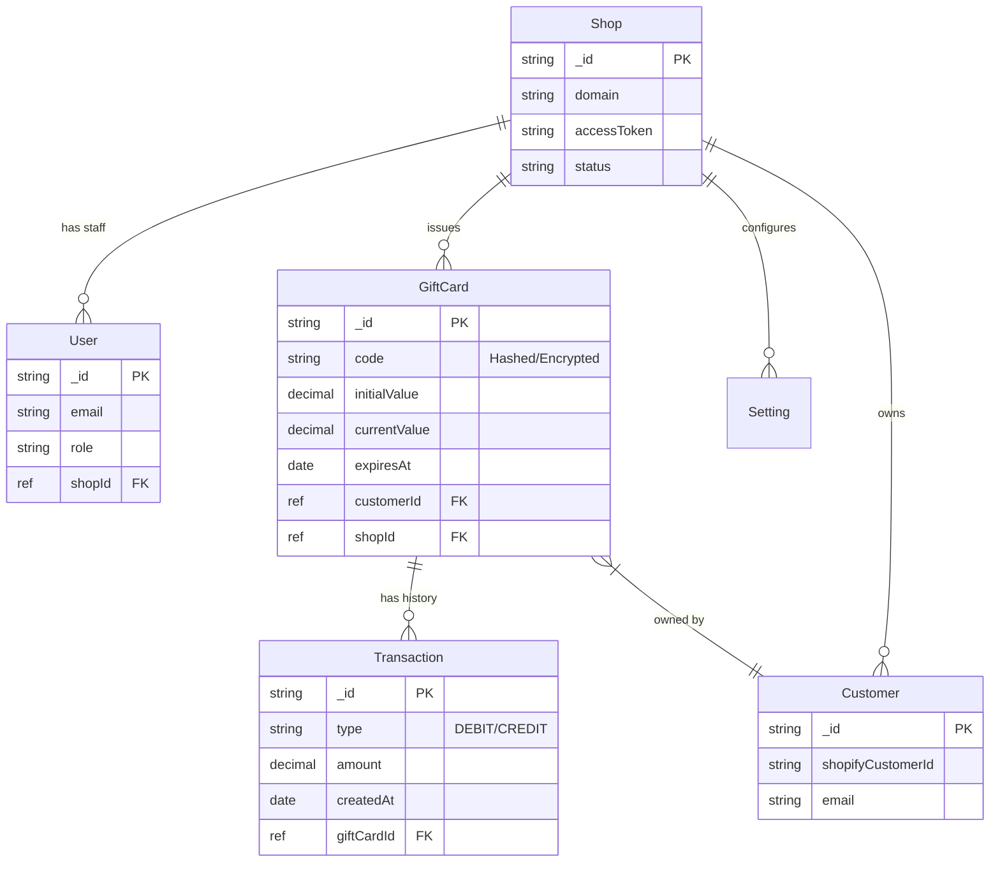
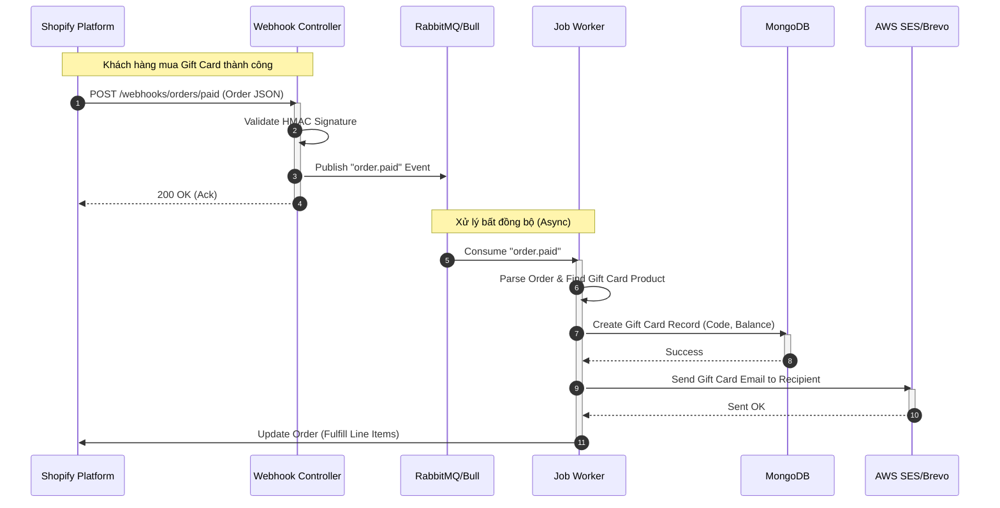

# SYSTEM ARCHITECTURE DOCUMENT - VIFY GIFT CARD V2

## 1. OVERVIEW (Tổng quan)
**VIFY Gift Card v2** là một ứng dụng trong hệ sinh thái Shopify, cung cấp giải pháp toàn diện cho việc phát hành, quản lý và tùy chỉnh thẻ quà tặng (Gift Card). Hệ thống được thiết kế theo kiến trúc **Monolithic Modular** (mô-đun hóa) trên nền tảng NestJS, sử dụng MongoDB làm cơ sở dữ liệu chính và kết hợp Redis/RabbitMQ cho các tác vụ xử lý nền (background jobs) và hàng đợi (queue).

Dự án bao gồm 3 thành phần chính:
1.  **Core Backend & API (`web`)**: Xử lý logic nghiệp vụ, API, webhook và background jobs.
2.  **Embedded App Frontend (`web/frontend`)**: Giao diện quản trị nhúng trực tiếp trong Shopify Admin.
3.  **Theme Builder (`theme-builder`)**: Công cụ visual editor tách biệt giúp merchant tùy chỉnh mẫu thẻ quà tặng.

---

## 2. TECH STACK (Công nghệ sử dụng)

| Category | Technology | Version | Description |
| :--- | :--- | :--- | :--- |
| **Backend Framework** | NestJS | 10.x | Framework chính, kiến trúc Module/Service/Controller. |
| **Language** | TypeScript | 5.x | Ngôn ngữ chính cho cả Backend và Frontend. |
| **Database** | MongoDB | 7.x (via Mongoose) | NoSQL Database lưu trữ Shop, User, GiftCard. |
| **Queue & Messaging** | RabbitMQ & Bull | - | Xử lý Webhook (RabbitMQ) và Job nội bộ (Bull). |
| **Cache** | Redis | - | Caching và backend cho Bull Queue. |
| **Frontend (App)** | React + Vite | - | Giao diện Embedded App trong Shopify Admin. |
| **Frontend (Builder)** | React + Vite | - | Tool dựng mẫu thẻ (Theme Builder). |
| **Styling** | Tailwind CSS | - | Utility-first CSS framework. |
| **Infrastructure** | Docker & Docker Compose | - | Containerization cho môi trường Dev/Prod. |
| **Third-party** | AWS SDK (S3, SES) | 3.x | Lưu trữ ảnh thẻ (S3) và gửi Email (SES). |
| **Shopify Integration** | @shopify/shopify-api | 11.x | Giao tiếp với Shopify GraphQL/REST Admin API. |

---

## 3. HIGH-LEVEL ARCHITECTURE
Sơ đồ tổng quan kiến trúc hệ thống, thể hiện luồng dữ liệu từ Merchant/Customer đến hệ thống và các dịch vụ phụ trợ.

```mermaid
graph TD
    %% Define Nodes
    Merchant[Merchant (Shopify Admin)]
    Customer[Customer (Storefront)]
    Shopify[Shopify Platform]
    
    subgraph "Infrastructure (Docker/Cloud)"
        LB[Load Balancer / Nginx]
        
        subgraph "Application Layer"
            NestJS[NestJS Server<br/>(API & Workers)]
            ThemeBuilder[Theme Builder App]
        end
        
        subgraph "Data & Messaging Layer"
            MongoDB[(MongoDB<br/>Primary Data)]
            Redis[(Redis<br/>Cache & Bull Queue)]
            RabbitMQ[RabbitMQ<br/>Message Broker]
        end
    end
    
    subgraph "External Services"
        AWS_S3[AWS S3<br/>Storage]
        AWS_SES[AWS SES<br/>Email]
    end

    %% Connections
    Merchant -->|HTTPS| Shopify
    Customer -->|HTTPS| Shopify
    
    Shopify -->|Embedded Iframe| LB
    Shopify -->|Webhooks| LB
    
    LB --> NestJS
    LB --> ThemeBuilder
    
    NestJS -->|Read/Write| MongoDB
    NestJS -->|Cache/Job| Redis
    NestJS -->|Publish/Consume| RabbitMQ
    
    NestJS -->|Upload Assets| AWS_S3
    NestJS -->|Send Emails| AWS_SES
    NestJS -->|GraphQL/REST API| Shopify
    
    %% Styles
    style NestJS fill:#e1f5fe,stroke:#01579b,stroke-width:2px
    style MongoDB fill:#e8f5e9,stroke:#2e7d32,stroke-width:2px
    style Shopify fill:#f3e5f5,stroke:#7b1fa2,stroke-width:2px
```

---

## 4. PROJECT STRUCTURE (Cấu trúc dự án)
Phân tích trách nhiệm của các thư mục quan trọng dựa trên cây thư mục hiện tại.

### `web/` (Backend & Main App)
Đây là trái tim của hệ thống.
*   **`src/modules/`**: [Core] Chứa logic nghiệp vụ chính (Product, Order, GiftCard logic), được chia nhỏ theo tính năng (Modular).
*   **`src/controllers/`**: [Cần cập nhật] *Giả định dựa trên NestJS:* Nơi định nghĩa các API Endpoints (REST) để Frontend gọi vào.
*   **`src/entities/`** (hoặc Schemas): Định nghĩa cấu trúc dữ liệu MongoDB (Mongoose Schemas) như Shop, User, Settings.
*   **`src/graphql/`**: Chứa các file query/mutation để **gọi sang Shopify Admin API** (Không phải để serve API cho client).
*   **`src/console/`**: Các lệnh CLI (Command Line Interface) để chạy migration, seed data, hoặc các tool fix lỗi thủ công.
*   **`frontend/`**: Source code ReactJS cho ứng dụng nhúng trong Shopify Admin.
*   **`config/`**: Quản lý biến môi trường và cấu hình các dịch vụ (AWS, DB, Mail, Queue).

### `extensions/` (Shopify Extensions)
*   **`vify-gift-card-embed/`**: Chứa code của Shopify Theme App Extensions (Liquid blocks) để hiển thị form nhập mã quà tặng hoặc kiểm tra số dư trực tiếp trên Storefront của merchant.

### `theme-builder/` (Standalone Tool)
*   Một dự án React/Vite riêng biệt.
*   **Trách nhiệm**: Cung cấp giao diện kéo thả (Drag & Drop) hoặc visual editor để merchant thiết kế mẫu email/thẻ quà tặng. Kết quả build có thể được lưu xuống DB hoặc export ra assets.

---

## 5. DATABASE DESIGN (Schema Design)
Dựa trên `web/src/entities` và ngữ cảnh dự án Gift Card, dưới đây là thiết kế sơ đồ quan hệ thực thể (ERD) mức logic.

*Lưu ý: Vì dùng MongoDB, quan hệ ở đây là tham chiếu (Reference) logic, không phải Foreign Key cứng như SQL.*



---

## 6. KEY FLOW (Luồng xử lý chính)
**Quy trình: Xử lý Webhook khi có Đơn hàng mới (Order Created) chứa Gift Card.**
Đây là luồng quan trọng nhất để tự động phát hành thẻ khi khách mua hàng.



---

## 7. INFRASTRUCTURE & DEPLOYMENT
Hướng dẫn vận hành dựa trên các file config (`docker-compose.yaml`, `.env`).

### Môi trường Local (Development)
Hệ thống sử dụng Docker Compose để dựng các dịch vụ phụ trợ.
*   **Chạy lệnh:**
    ```bash
    npm run dev
    # Lệnh này sẽ chạy song song:
    # 1. NestJS Server (Port 3000/8081)
    # 2. Theme Builder (Vite)
    # 3. Docker containers (MongoDB, Redis, RabbitMQ)
    ```
*   **Port Mapping (Mặc định):**
    *   Backend: `3000` (hoặc cổng quy định trong `.env`)
    *   MongoDB: `27017`
    *   Redis: `6379`
    *   RabbitMQ: `5672` (MQ), `15672` (Management UI)

### Cơ chế lưu trữ & State
*   **MongoDB Data**: Mount volume tại `.docker/data/db` (hoặc tương tự) để giữ dữ liệu khi restart container.
*   **Logs**: Thư mục `web/logs` được sử dụng để lưu file log (Winston logger), cần mount ra ngoài host nếu chạy production docker.

---
*Tài liệu được trích xuất tự động dựa trên phân tích source code ngày 07/01/2026.*
